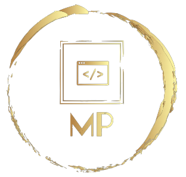

<div align="center">
  
  <br/>
</div>

<a name="readme-top"></a>
<div align="center">
<h1><b>Ruby-Morse-code-message</b></h1>

</div>

# 📗 Table of Contents

- [📗 Table of Contents](#-table-of-contents)
- [📖 Ruby Morse Code Message ](#-morse-message-)
  - [🛠 Built With ](#-built-with-)
    - [Tech Stack ](#tech-stack-)
    - [Key Features ](#key-features-)
  - [💻 Getting Started ](#-getting-started-)
    - [Prerequisites](#prerequisites)
    - [Setup](#setup)
    - [Install](#install)
    - [Usage](#usage)
    - [Run tests](#run-tests)
    - [Deployment](#deployment)
  - [👥 Authors ](#-authors-)
  - [🤝 Contributing ](#-contributing-)
  - [⭐️ Show your support ](#️-show-your-support-)
  - [🙏 Acknowledgments ](#-acknowledgments-)
  - [📝 License ](#-license-)

# 📖 Ruby Morse Code Message <a name="about-project"></a>


**Ruby Morse Code Message** is a basic programming operations repo to solve basic coding challenges using Ruby. It consists a script that can provide uppercase translations for words in Morse Code.

## 🛠 Built With <a name="built-with"></a>

### Tech Stack <a name="tech-stack"></a>

<details>
<summary>Server</summary>
  <ul>
    <li><a href="https://www.ruby-lang.org/en/">Ruby</a></li>
  </ul>
</details>

<!-- Features -->

### Key Features <a name="key-features"></a>

- **Morse Code Translation to Uppercase words and sentence**

<p align="right">(<a href="#readme-top">back to top</a>)</p>

<!-- GETTING STARTED -->

## 💻 Getting Started <a name="getting-started"></a>


To get a local copy up and running, follow these steps.

### Prerequisites

In order to run this project you need:
- To setup your invironment using WSL (Windows Subsystem For Linux) follow [here](https://gorails.com/setup/windows/11) 
- You can also follow [Ruby Interpreter](https://www.ruby-lang.org/en/downloads/)
- Setup [Development Environment](https://code.visualstudio.com/download)
- RubyGems: Verify by running `gem --version`

### Setup

Clone this repository to your desired folder:

```sh
  cd my-folder
  git clone https://github.com/porag-m06/Ruby-Morse-code-message.git
```

### Install

Install this project with:

```sh
  cd my-project
  gem install
```

### Usage

To run the project, execute the following command:


```sh
  rails server
```

### Run tests

To run tests, run the following command:

```sh
  bin/rails test test/models/article_test.rb
```


<p align="right">(<a href="#readme-top">back to top</a>)</p>

<!-- AUTHORS -->

## 👥 Author <a name="authors"></a>

> Developed by: 

### Md. Porag Sarkar
- GitHub: [@porag-m06](https://github.com/porag-m06)
- Twitter: [@twitterhandle](https://twitter.com/twitterhandle)
- LinkedIn: [LinkedIn](https://www.linkedin.com/in/muhammad-porag-nsu-cse/)

<p align="right">(<a href="#readme-top">back to top</a>)</p>


## 🤝 Contributing <a name="contributing"></a>

Contributions, issues, and feature requests are welcome!

Feel free to check the [issues page](https://github.com/porag-m06/Ruby-Morse-code-message/issues).

<p align="right">(<a href="#readme-top">back to top</a>)</p>


## ⭐️ Show your support <a name="support"></a>

As a tech enthusiast, your support is always appreciated. If you like this project please do let me know with your support in any way you see fit.

<p align="right">(<a href="#readme-top">back to top</a>)</p>


## 🙏 Acknowledgments <a name="acknowledgements"></a>
I would like to thank  [Microverse](https://github.com/microverseinc) for this project's info & guidelines.

<p align="right">(<a href="#readme-top">back to top</a>)</p>


## ❓ FAQ <a name="faq"></a>
- **Can I fork this project?**
  - Yes, feel free to fork and knock yourself out :) . 

- **Can I share this project with others?**
  - Yes, you can share this project for any educational purposes. 

<p align="right">(<a href="#readme-top">back to top</a>)</p>


## 📝 License <a name="license"></a>
This project is [MIT](./LICENSE) licensed.

<p align="right">(<a href="#readme-top">back to top</a>)</p>